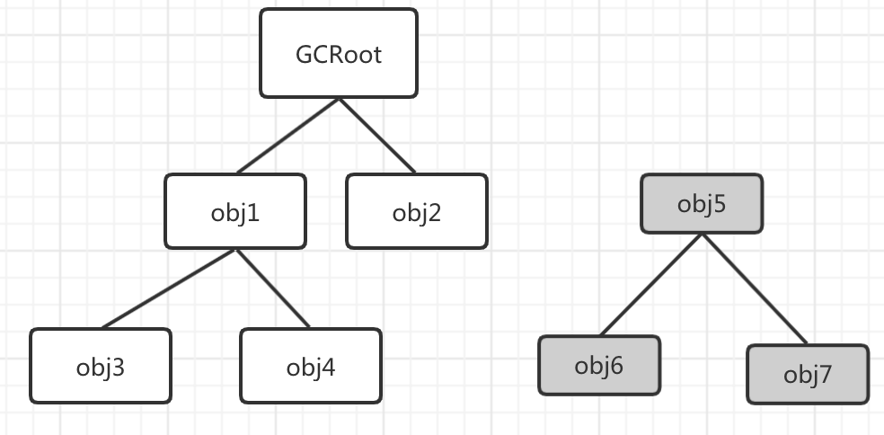
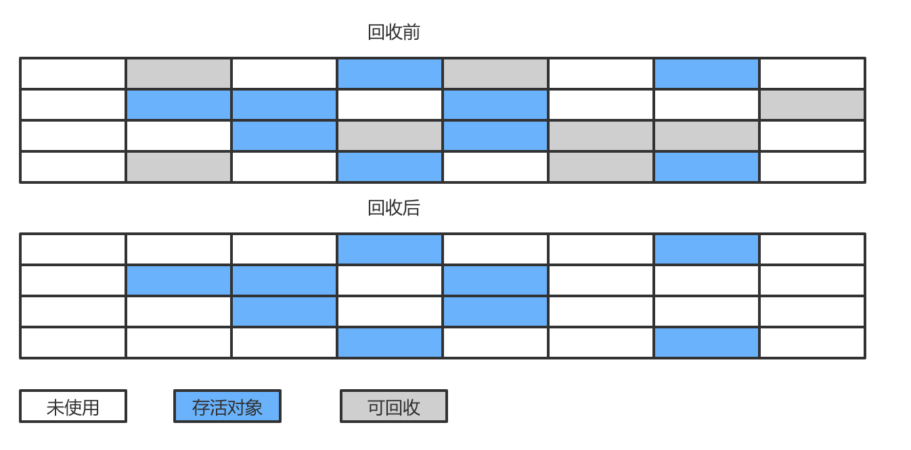
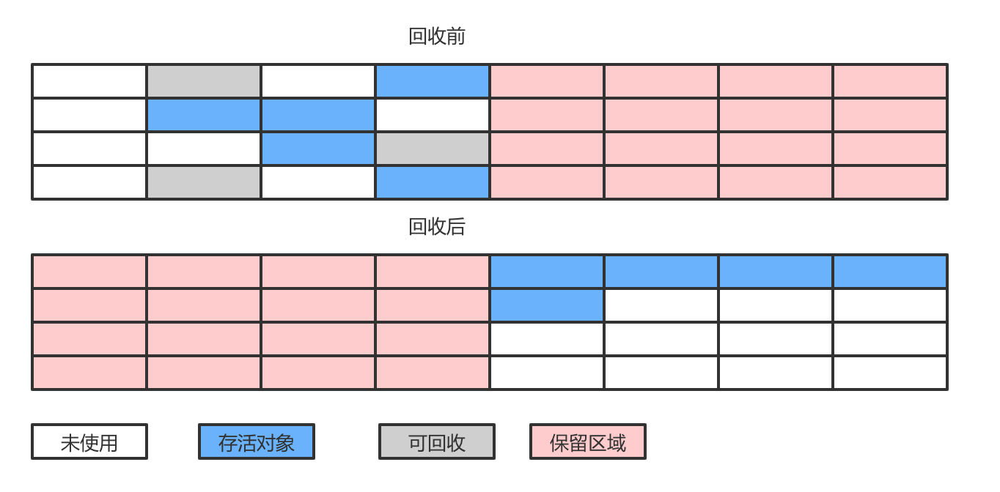
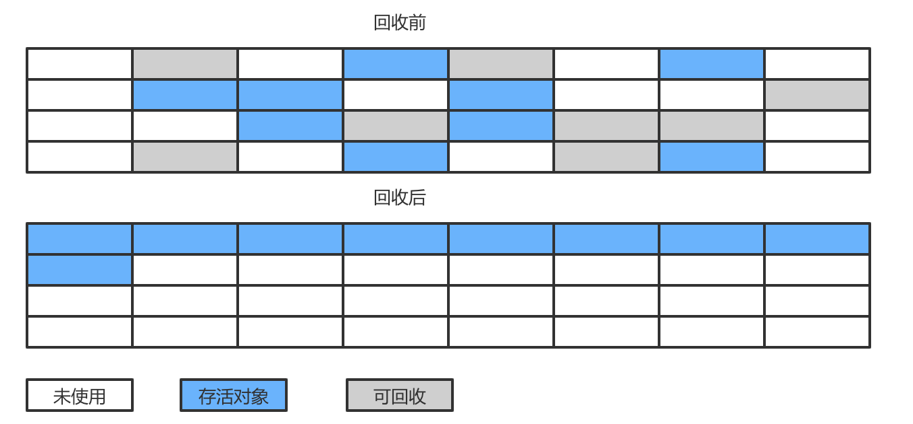

## GC与内存分配


### 1.对象如何分配

* Minor GC ： 新生代GC，频繁而且速度快
* Full GC ：老年代GC，通常伴随一次Minor GC，一般比Minor GC慢10倍以上

#### a.对象优先在Eden分配

大多数情况下，对象优先分配在Eden区，当Eden空间不够的时候尝试发起一次Minor GC

```java
/**
 * 提前分配在Eden区域，待分配内存不足的时候通过担保机制分配给老年区域
 * -Xms20M -Xmx20M -Xmn10M -XX:SurvivorRatio=8 -XX:+PrintGCDetails
 * -XX:PretenureSizeThreshold 此参数可以直接分配大于此参数值的对象到老年区，但是区分虚拟机
 */
public class AssignTest {
    private static final int _1MB = 1024 * 1024;
    public static void main(String[] args) {
        byte[] allocation1,allocation2,allocation3,allocation4;
        allocation1 = new byte[2 * _1MB];
        allocation2 = new byte[2 * _1MB];
        allocation3 = new byte[2 * _1MB];
        allocation4 = new byte[3 * _1MB];
    }
}
```

```shell
[GC (Allocation Failure) [PSYoungGen: 7843K->528K(9216K)] 7843K->6680K(19456K), 0.0042161 secs] [Times: user=0.02 sys=0.01, real=0.00 secs] 
[Full GC (Ergonomics) [PSYoungGen: 528K->0K(9216K)] [ParOldGen: 6152K->6513K(10240K)] 6680K->6513K(19456K), [Metaspace: 3003K->3003K(1056768K)], 0.0042622 secs] [Times: user=0.02 sys=0.00, real=0.01 secs] 
Heap
 PSYoungGen      total 9216K, used 3237K [0x00000007bf600000, 0x00000007c0000000, 0x00000007c0000000)
  eden space 8192K, 39% used [0x00000007bf600000,0x00000007bf9297b0,0x00000007bfe00000)
  from space 1024K, 0% used [0x00000007bfe00000,0x00000007bfe00000,0x00000007bff00000)
  to   space 1024K, 0% used [0x00000007bff00000,0x00000007bff00000,0x00000007c0000000)
 ParOldGen       total 10240K, used 6513K [0x00000007bec00000, 0x00000007bf600000, 0x00000007bf600000)
  object space 10240K, 63% used [0x00000007bec00000,0x00000007bf25c510,0x00000007bf600000)
 Metaspace       used 3025K, capacity 4496K, committed 4864K, reserved 1056768K
  class space    used 331K, capacity 388K, committed 512K, reserved 1048576K
```

可以看到新生代总空间是9216K（Eden区8M+一个Survivor1M）

新生代空间从7843K->528K，但是总结果没有大的变化，因为（allocation1，allocation2，allocation3）没有被回收

老年代总空间是10M,被占用63%，因为allocation4在分配的时候新生代空间不足，allocation1，allocation2，allocation3被提前分配到了老年代。

此次GC的结果是，3M的allocation4被留在了Eden区，allocation1到allocation3被担保到了老年区。Survivor空闲，因为它谁也放不下。


#### b.大对象直接进入老年区

还是刚才的例子

```java
public static void main(String[] args) {
        byte[] allocation1,allocation2,allocation3,allocation4;
//        allocation1 = new byte[2 * _1MB];
//        allocation2 = new byte[2 * _1MB];
//        allocation3 = new byte[2 * _1MB];
        allocation4 = new byte[7 * _1MB];
    }
```

```shell
Heap
 PSYoungGen      total 9216K, used 1863K [0x00000007bf600000, 0x00000007c0000000, 0x00000007c0000000)
  eden space 8192K, 22% used [0x00000007bf600000,0x00000007bf7d1d38,0x00000007bfe00000)
  from space 1024K, 0% used [0x00000007bff00000,0x00000007bff00000,0x00000007c0000000)
  to   space 1024K, 0% used [0x00000007bfe00000,0x00000007bfe00000,0x00000007bff00000)
 ParOldGen       total 10240K, used 7168K [0x00000007bec00000, 0x00000007bf600000, 0x00000007bf600000)
  object space 10240K, 70% used [0x00000007bec00000,0x00000007bf300010,0x00000007bf600000)
 Metaspace       used 3009K, capacity 4496K, committed 4864K, reserved 1056768K
  class space    used 331K, capacity 388K, committed 512K, reserved 1048576K
```

可以看到没有触发GC，7M的allocation4对象被直接分配在了老年区。

`-XX：PretenureSizeThreshold`可以设置大于此参数的对象可以直接分配在老年区。

#### c.长期存活的对象进入老年代

如果对象在Eden出生，并经过一次Minor GC之后仍然存活，并能被Survivor容纳的话，就被移动到Survivor区，年龄为1岁，默认到15岁的时候移动到老年区

`-XX：MaxTenuringThreshold`控制年龄阈值。

#### d.动态年龄判断

如果在Survivor区域中，相同年龄的对象大小总和超过Survivor空间的一半，那么大于等于该年龄的对象就可以提前进入老年代

#### e.空间分配担保

Minor GC的时候，虚拟机会检查每次晋升到老年代的平均大小是否大于老年代的剩余空间大小，如果大于就进行Full GC，如果小于就会检查`HandlePromotionFailure`是否允许担保失败，如果不允许担保失败就进行Full GC，否则进行Minor GC


### 2.对象被回收标准

GC之前要判断哪些对象可以回收，判定的方法一般有两种：引用计数和跟搜索算法。

#### a.引用计数算法

有一个地方引用的时候计数器值加1，引用失效数值减1，但是会有对象循环引用问题。

`objA.instance = objB `

`objB.instance = objA`


#### b.根搜索算法

可达性分析。从一系列GC Root对象作为起点，开始向下搜索，搜索走过的路径称为引用链，当一个对象到GCRoot没有任何引用链的时候，此对象不可用。如下图的灰色部分就是可回收对象。



GCRoot有以下几类

* 虚拟机栈中引用的对象
* 方法区中常量引用的对象
* 方法区中类静态属性引用的对象
* 本地方法栈中引用的对象

#### c.四大引用

* 强引用，new出来的对象，GC永远不会回收
* 弱引用（SoftReference），内存溢出之前尝试回收，回收失败才会抛出内存溢出。
* 软引用（WeakReference），GC遇到就会回收
* 虚引用（PhantomReference）,无法通过虚引用获取对象，只是能在对象被回收之前获取一个通知。

#### d.逃脱回收

finalize方法可以使对象死里逃生。

GC过后，没有GC链的对象会被标记和进行筛选，筛选的标准就是有没有覆写finalize方法，如果没有覆写或者已经被执行过了，那么对象就没有必要存活。


### 3.对象怎么回收（垃圾回收算法）

#### 1.标记-清除算法

分为标记和清除两个阶段，首先标记出可回收对象，然后统一清除被标记的对象

* 效率不高，标记和清除效率都不高
* 产生大量不连续的空间碎片



#### 2.复制算法

把内存区域划分为大小相同的两块，每次只使用其中一块，内存用尽的时候，将存活对象复制到保留区域，然后将已使用的空间一次清理。

* 简单高效
* 内存变为原来一般，代价太大

IBM研究新生代的对象80%是朝生夕死，所以不需要等量划分区域，他们将新生代划分为一块较大的Eden区域和两块较小的Survivor区域。每次使用Eden和一块Survivor区域，回收时，将存活对象复制到另一块Survivor区域然后清理掉刚才用过的区域。当Survivor不够用的时候，老年代空间担保。



#### 3.标记整理算法

基于标记清楚算法，演进了标记整理算法，标记过程一样，但是后续步骤是：让所有存活对象向一端移动，然后清理掉端边界之外的内存。



#### 4.分代收集

分代收集没有新思想，而是根据对象存活周期不同，将内存划分为几块，一般是划分为新生代和老年代。然后根据各个年代特点采用不同算法。比如新生代朝生夕死就采用复制算法，老年代存活率高而且没有其他区域进行复制担保就采用标记整理或者标记清除算法。