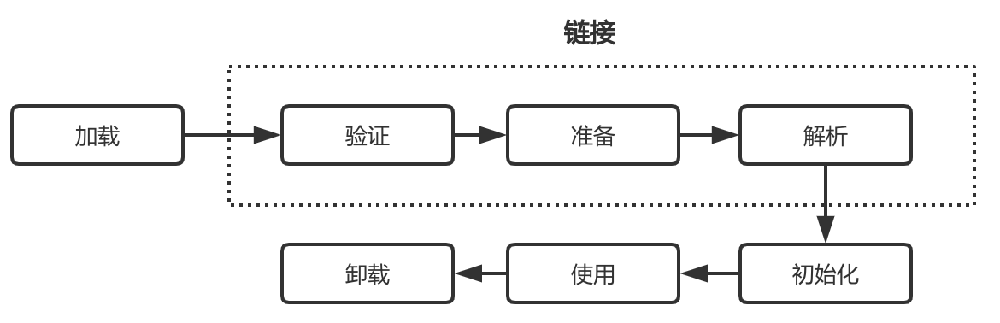
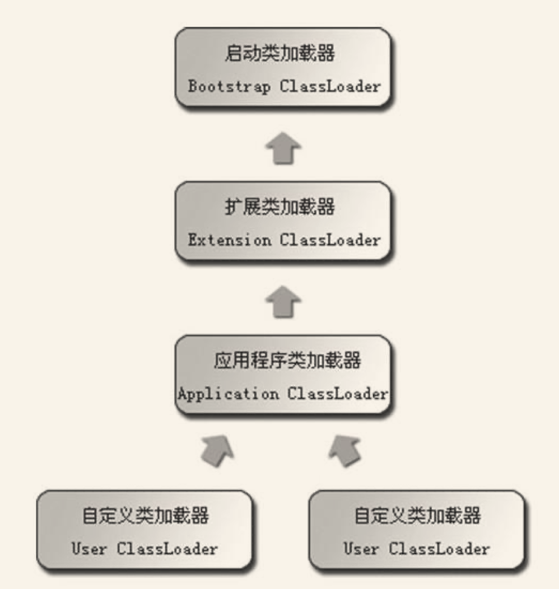

## 类加载机制


### 1.类加载时机

类的声明周期如下：包含七个阶段




#### a.类加载

类加载的时机不限制，由虚拟机自行实现

#### b.类的初始化

类的初始化严格限制，有且只有下述四种场景

* 遇到new/putstatic/getstatic/invokestatic字段的时候（new关键字实例化对象，读写静态字段，调用类的静态方法）
* 对类进行反射调用，如果没有初始化要先触发初始化
* 初始化一个类的时候，如果父类没有初始化，先初始化父类
* 虚拟机启动首先初始化包含main方法的主类

#### c.类不会初始化的情形

* 子类引用父类的静态字段，子类不会初始化

  ```java
  public class SuperClass {
      static {
          System.out.println("SuperClass init");//会打印
      }
      static int value;
  }
  public class SubClass extends SuperClass{
      static {
          System.out.println("SubClass init");//不会打印
      }
  }
  public class InitTest {
      public static void main(String[] args) {
          System.out.println("------ "+SubClass.value);
      }
  }
  ```

* 数组引用类，不会触发类的初始化

  ```java
  public class LoadingTest {
      public static void main(String [] args){
          //这里也不会初始化SuperClass，因为实例化的是"SuperClass"的数组
          SuperClass[] superClasses = new SuperClass[10];
      }
  }
  ```

* 常量在编译阶段的优化，会存入到调用类的常量池，本质上没有直接引用定义常量的类

  ```java
  public class ConstLoading {
      static {
          System.out.println("ConstLoading init !!!");
      }
      public static final String HELLO ="HELLO";
  }
  class NotInit{
          public static void main(String [] args){
              //也不会实例化ConstLoading,编译阶段的优化，常量已经传输到了此类的常量池，编译完成之后，两个类就不存在联系了
              System.out.println(ConstLoading.HELLO);
          }
  }
  ```

### 2.类加载过程


#### 加载

加载阶段虚拟机做3件事

* 1）通过一个类的全限定名来获取定义此类的二进制字节流。(不指定来源)

* 2）将这个字节流所代表的静态存储结构转化为方法区的运行时数据结构。

* 3） 在Java堆中生成一个代表这个类的java.lang.Class对象，作为方法区这些数据的访问入口

加载阶段可控性最强，可以自定义类加载器。

#### 验证

确保Class文件包含的信息符合虚拟机规范，大致包含四步

* 文件格式验证（是否魔数开头，主次版本号，常量标志是否能被识别等）
* 元数据验证（是否有父类，是否继承了不该继承的类，是否实现了父类或者接口要求的所有方法，非法的重载和字段覆盖）
* 字节码验证，保证被校验类的方法不会危害虚拟机
* 符号引用验证，对类自身以外的信息进行校验（符号引用的全限定名是否能找到类，符号引用的类、字段和方法的访问性可否被类访问）

#### 准备

正式为类变量分配内存并设置初始值的阶段，仅仅是类变量（static修饰）

如`static int value = 123`,准备阶段过后值就是0.但是常量会就是定义的值。

reference的初始值是null

#### 解析

将常量池内的符号引用转换为直接引用的过程

在常量池中存在的形式是`CONSTANT_Class_info，CONSTANT_Fieldref_info，CONSTANT_Methodref_info`等

* 符号引用，一组符号描述引用的目标，符号可以是任何形式的字面量，能定位到目标即可。
* 直接引用,直接指向目标的指针或者间接定位目标的句柄

解析阶段的具体时间不定，但是遇到anewarray、checkcast、getfield、getstatic、instanceof、invokeinterface、invokespecial、invokestatic、invokevirtual、multianewarray、new、putfield和putstatic这13个用于操作符号引用的字节码指令之前，要对他们使用到的符号进行解析

**如果父类和接口以及子类存在同名字段，在调用子类字段的时候，编译器拒绝编译。**


#### 初始化

真正执行java代码，根据程序的设计执行代码初始化。

先静态变量再静态方法，父类优先子类。

### 3.类加载器

#### 类加载器

* 启动类加载器，负责加载<JAVA_HOME>/lib目录下的文件
* 扩展类加载器，负责加载<JAVA_HOME>/lib/ext目录下的文件
* 应用程序类加载器，加载用户路径下的文件

#### 双亲委派模型



上图所示类加载器的结构就是双亲委派模型，要求除了启动类加载器之外，其他类加载器都应该有自己的父类加载器。

工作过程是：类加载器收到类加载的请求，自己不会先尝试去加载这个类，而是将这个请求交给父类去加载,每一个层次的类加载器都是如此。因此所有的请求都会交由启动类加载器去执行，当父类反馈自己无法加载这个请求的时候，才会交给子类去操作。

优点：Java类随着类加载器具有了一种层次结构，每一个类都会交给启动类加载器进行加载，保证加载类的有序唯一。


#### 破坏双亲委派

* 双亲委派之前，类加载器已经存在，自定义类加载器。
* 线程上下文类加载器，基础类依赖用户代码的情况。
* 模块热部署。用户层面。