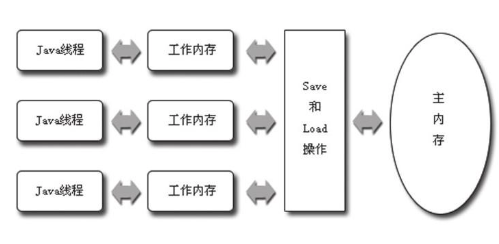

## Java 内存模型与线程

### Java内存模型

Java虚拟机试图定义一种Java内存模型（Java Memory Model, JMM）来屏蔽掉各种硬件和操作系统的内存访问差异，以实现让Java程序在各种平台下都能达到一致的并发效果。

Java内存模型的主要目标是定义程序中各个变量的访问规则，即在虚拟机中将变量存储到内存和从内存中取出变量这样的底层细节。（变量包括实例字段、静态字段、构成数组对象的元素等线程共享的元素）

Java内存模型规定了所有的变量都存储在主内存（Main Memory）中（。每条线程还有自己的工作内存（Working Memory），线程的工作内存中保存了被该线程使用到的变量的主内存副本拷贝，线程对变量的所有操作（读取、赋值等）都必须在工作内存中进行，而不能直接读写主内存中的变量。不同的线程之间也无法直接访问对方工作内存中的变量，线程间变量值的传递均需要通过主内存来完成。

线程、主内存、工作内存三者的交互关系如图所示。

主存和工作内存之间的交互细节有以下8种：

* lock（锁定）：作用于主内存的变量，它把一个变量标识为一条线程独占的状态。

* unlock（解锁）：作用于主内存的变量，它把一个处于锁定状态的变量释放出来，释放后的变量才可以被其他线程锁定。

* read（读取）：作用于主内存的变量，它把一个变量的值从主内存传输到线程的工作内存中，以便随后的load动作使用。

* load（载入）：作用于工作内存的变量，它把read操作从主内存中得到的变量值放入工作内存的变量副本中。

* use（使用）：作用于工作内存的变量，它把工作内存中一个变量的值传递给执行引擎，每当虚拟机遇到一个需要使用到变量的值的字节码指令时将会执行这个操作。

* assign（赋值）：作用于工作内存的变量，它把一个从执行引擎接收到的值赋值给工作内存的变量，每当虚拟机遇到一个给变量赋值的字节码指令时执行这个操作。

* store（存储）：作用于工作内存的变量，它把工作内存中一个变量的值传送到主内存中，以便随后的write操作使用。

* write（写入）：作用于主内存的变量，它把store操作从工作内存中得到的变量的值放入主内存的变量中。

	不允许read和load、store和write操作之一单独出现

### 原子性、可见性、有序性

long和double的非原子性协定，64位数据的读写操作划分为两次32位的操作进行。

#### 1.原子性

由Java内存模型来直接保证的原子性变量操作包括read、load、assign、use、store和write这六个，大致可以认为基本数据类型的访问读写是具备原子性的（long和double的非原子性协定例外)

**lock和synchronize提供更大范围的原子保证**

#### 2.可见性

可见性就是指当一个线程修改了共享变量的值，其他线程能够立即得知这个修改。Java内存模型是通过在变量修改后将新值同步回主内存，在变量读取前从主内存刷新变量值这种依赖主内存作为传递媒介的方式来实现可见性的，无论是普通变量还是volatile变量都是如此，普通变量与volatile变量的区别是volatile的特殊规则保证了新值能立即同步到主内存，以及每次使用前立即从主内存刷新。因此我们可以说volatile保证了多线程操作时变量的可见性，而普通变量则不能保证这一点。

**synchronized和final也能保证可见性**

#### 3.有序性

Java程序中天然的有序性可以总结为一句话：如果在本线程内观察，所有的操作都是有序的；如果在一个线程中观察另一个线程，所有的操作都是无序的。

前半句是指“线程内表现为串行的语义”（Within-Thread As-If-Serial Semantics）

后半句是指“指令重排序”现象和“工作内存与主内存同步延迟”现象。

### 线程实现

#### 1.内核线程

由操作系统支持的线程，内核通过调度器对线程进行调度。

#### 2.用户线程

狭义的用户线程是指建立在用户空间的线程库上，系统内核不能感知，线程的建立使用销毁在用户空间完成，不需要系统的支持

### Java 线程调度

#### 1.协同式线程调度

线程的执行时间由自身控制，线程把自身的工作执行完毕之后主动通知系统切换到另外的线程。

实现简单，但是会存在线程执行时间不可控的问题，导致系统崩溃。

#### 2.抢占式线程调度

线程的切换不由自己决定，系统为线程分配执行时间，Java中可以设置线程的优先级

